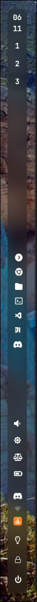

# Starfall .files
These are my hyprland(arch) dotfiles.

## Programs needed
- hyprland
- hyprpaper
- kitty
- waybar
- wofi
- wlogout
- grim, slurp, swappy
- swaync
- swaylock-effects
- swayidle
- [synth-shell](https://github.com/andresgongora/synth-shell)
- ***Gnome46 required for some configs to work***
> Gtk theme & icons: Colloid Dark (Purple version for icons)
> Cursor theme: Qogir Dark

## Pictures

#### Waybar Update:

